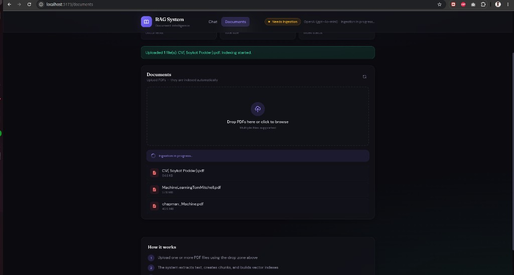
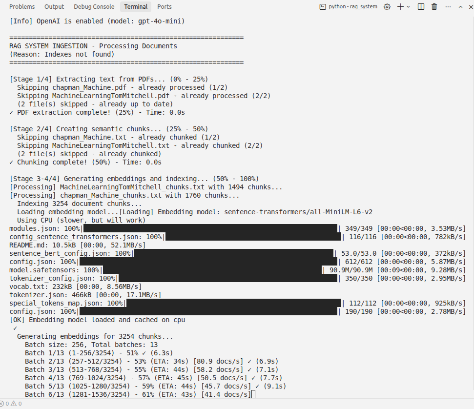
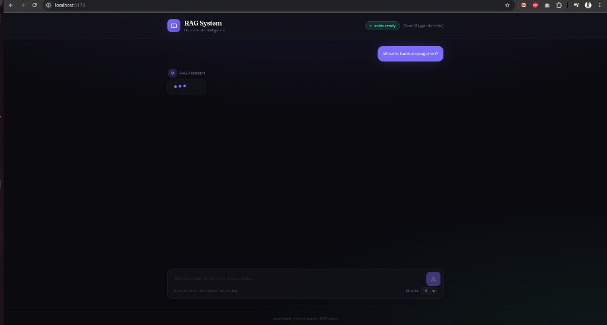
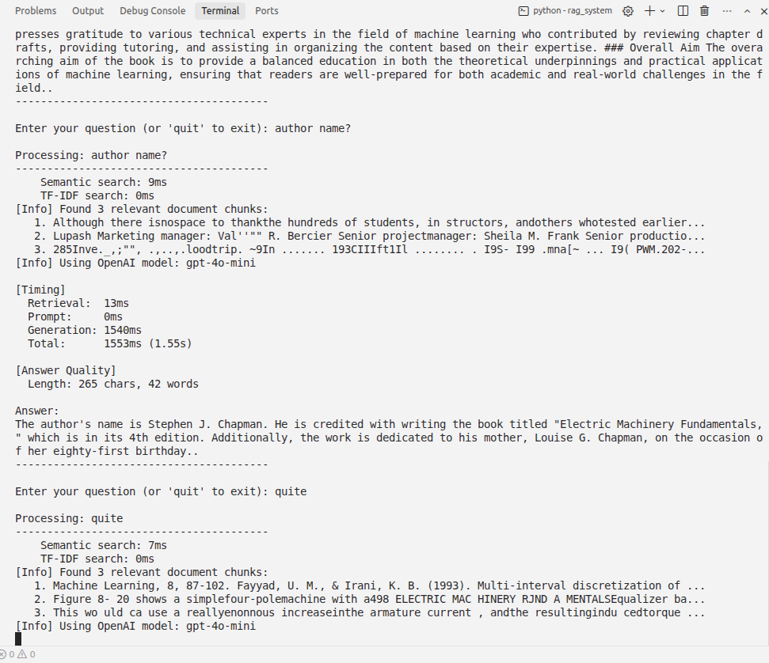

# RAG System - Retrieval-Augmented Generation Pipeline

A comprehensive Retrieval-Augmented Generation (RAG) system that processes PDF documents, creates searchable vector indexes, and generates contextual answers using local LLMs (Ollama) with Pinecone vector database and TF-IDF retrieval.

## 📋 Table of Contents

- [Overview](#overview)
- [Screenshots](#screenshots)
- [How It Works](#how-it-works)
- [LangGraph Orchestration](#langgraph-orchestration)
- [MCP Integration (Cursor)](#mcp-integration-cursor)
- [Features](#features)
- [Installation](#installation)
- [Quick Start](#quick-start)
- [Usage](#usage)
- [Configuration](#configuration)
- [Architecture](#architecture)
- [Performance](#performance)
- [Troubleshooting](#troubleshooting)

## 🎯 Overview

This RAG system combines:
- **Pinecone** (cloud vector database) for fast semantic search
- **Ollama** (local LLM) for fast answer generation
- **TF-IDF** for keyword-based retrieval
- **Hybrid search** combining semantic and keyword matching

**Key Point**: Pinecone is used for **finding** relevant information, while Ollama is used for **generating** the answer.

## 📸 Screenshots

### Web UI — Document upload & indexing

Upload PDFs on the **Documents** page. Files are saved and indexed automatically in the background.



### Ingestion pipeline (CLI)

The ingestion pipeline extracts text, chunks documents, generates embeddings, and builds vector indexes.



### Web UI — Chat

Ask questions in the **Chat** page. The system retrieves relevant chunks and generates a synthesized answer with source citations.



### CLI — Query with timing

Run queries from the terminal with detailed timing for retrieval and generation.



## 🔄 How It Works

The RAG system uses a two-stage process:

```
User Question
    ↓
1. RETRIEVAL (Pinecone/FAISS)
   - Query is embedded using sentence-transformers
   - Pinecone searches for similar document chunks
   - Returns top-k most relevant chunks
    ↓
2. PROMPT BUILDING
   - Relevant chunks + user query → formatted prompt
    ↓
3. GENERATION (Ollama/TinyLlama)
   - Prompt sent to Ollama API
   - Ollama generates answer based on context
    ↓
4. POST-PROCESSING
   - Clean answer (remove repetition, format)
   - Return final answer
```

### Component Roles

**Pinecone (Vector Database)**
- **Purpose**: Store and search document embeddings
- **Used for**: Finding relevant document chunks
- **NOT used for**: Generating answers

**Ollama (LLM)**
- **Purpose**: Generate answers from context
- **Used for**: Answer generation
- **Input**: Prompt with retrieved chunks + query
- **Output**: Generated answer text

## 🔀 LangGraph Orchestration

The RAG pipeline is orchestrated with **LangGraph** in `rag_system/rag_agent/graph.py`. Instead of a single linear function, each step is a graph node with explicit state and routing.

### Pipeline Flow

```
User Query
    ↓
check_cache ──(cache hit)──→ END
    │
    └──(cache miss)──→ retrieve → build_prompt → generate → END
```

| Node | What it does |
|------|----------------|
| `check_cache` | Returns a cached answer if the same query was seen before |
| `retrieve` | Hybrid search (semantic + TF-IDF) over indexed chunks |
| `build_prompt` | Combines retrieved chunks and the user query into a prompt |
| `generate` | Calls OpenAI or Ollama to produce the final answer |

State is tracked in `RAGState` (`rag_system/rag_agent/state.py`): query, docs, prompt, answer, timing, and step history.

### Benefits of LangGraph

- **Clear separation of steps** — retrieval, prompting, and generation are isolated and easy to debug
- **Conditional routing** — cache hits skip retrieval and generation entirely
- **Observable pipeline** — per-step timing and a `steps` trail show exactly what ran
- **Easy to extend** — add nodes (e.g. reranking, query rewriting, validation) without rewriting the whole pipeline
- **Reusable entry point** — the same graph powers the CLI, programmatic API, and MCP tools

### Using LangGraph Directly

```python
from rag_agent.graph import run_rag_graph

result = run_rag_graph(
    "What is backpropagation?",
    top_k=3,
    show_timing=True,
)

print(result["answer"])
print(result["timing"])   # retrieval_ms, prompt_ms, generation_ms, total_ms
print(result["steps"])    # e.g. ['check_cache', 'retrieve', 'build_prompt', 'generate']
```

The CLI uses this graph internally via `rag_pipeline()` in `main.py`.

## 🔌 MCP Integration (Cursor)

**MCP (Model Context Protocol)** exposes the RAG system as tools that **Cursor** (and other MCP clients) can call from chat — so you can ask questions about your documents without leaving the IDE.

### Available MCP Tools

| Tool | Description |
|------|-------------|
| `rag_query` | Full RAG: retrieve relevant chunks and generate an answer |
| `rag_research` | Deep research: multi-query retrieval + structured report (use for `/research` or "research on …") |
| `rag_retrieve` | Search only — return source chunks without generating an answer |
| `rag_status` | Check whether indexes exist and are up to date |
| `rag_ingest` | Re-run ingestion (PDF extract → chunk → embed → index) |

### Setup in Cursor

1. Create or edit `.cursor/mcp.json` in the project root:

```json
{
  "mcpServers": {
    "rag-system": {
      "command": "/path/to/your/venv/bin/python",
      "args": ["mcp_server.py"],
      "cwd": "/path/to/Rag1_system/rag_system"
    }
  }
}
```

2. Replace `/path/to/your/venv/bin/python` with your virtualenv Python path.
3. Restart Cursor or reload MCP servers from **Settings → MCP**.
4. Ask questions in Cursor chat — the AI will call `rag_query` automatically when relevant.

### Running the MCP Server Manually (Optional)

```bash
cd rag_system
python main.py --mcp
# or
python mcp_server.py
```

You should see a startup banner listing tools, generation backend, and index status. The server then waits for an MCP client over stdio.

> **Note:** The MCP server terminal is **not** a chat interface. Do not type questions there — it expects JSON-RPC from Cursor. Use Cursor chat, or `python main.py` for terminal Q&A.

### Benefits of MCP

- **Ask from the IDE** — query your PDFs directly in Cursor chat without switching to a terminal
- **Tool-based access** — Cursor can retrieve, answer, check status, or re-ingest on demand
- **Same RAG pipeline** — MCP tools call the same LangGraph flow as the CLI
- **Composable** — works alongside other MCP servers (GitHub, Linear, etc.) in one chat session

## ✨ Features

- **Document Ingestion**: PDF to text conversion and intelligent chunking with structured content preservation
- **Indexing**: Pinecone vector database (cloud-based, scalable) with FAISS fallback
- **Retrieval**: Hybrid search with parallelized semantic (Pinecone) and keyword (TF-IDF) retrieval, with result caching
- **Synthesis**: Generate answers using Ollama (default, fast) or local LLM (TinyLlama) with answer post-processing
- **Performance**: Optimized for speed with parallel searches, caching, and performance monitoring
- **Quality**: Enhanced prompts and answer post-processing for better, more direct responses
- **Monitoring**: Detailed timing information and answer quality metrics
- **LangGraph Orchestration**: Stateful RAG pipeline with cache routing and per-step timing
- **MCP Server**: Expose RAG tools to Cursor and other MCP clients
- **OpenAI Support**: Optional OpenAI generation backend (configure via `.env`)

## 🚀 Installation

### Prerequisites

- Python 3.8 or higher
- Ollama (for best performance) - [Download](https://ollama.ai)
- Pinecone account (optional, for cloud vector storage) - [Sign up](https://www.pinecone.io/)

### Step 1: Clone and Install Dependencies

```bash
# Clone the repository
git clone <your-repo-url>
cd Rag1_system

# Install Python dependencies
pip install -r rag_system/requirements.txt
```

### Step 2: Install Ollama (Recommended)

**Windows:**
1. Download from https://ollama.com/download
2. Run `OllamaSetup.exe`
3. Follow the installation wizard
4. Ollama will start automatically

**After installation, pull a model:**
```bash
ollama pull llama3.2:3b
```

**Verify installation:**
```bash
ollama list
```

### Step 3: Set Up Environment Variables

Create a `.env` file in the root directory (`Rag1_system/.env`):

```bash
# Ollama Configuration (default, recommended for speed)
USE_OLLAMA=true
OLLAMA_MODEL=llama3.2:3b
OLLAMA_BASE_URL=http://localhost:11434
OLLAMA_TIMEOUT=120

# Pinecone Configuration (optional, for cloud vector storage)
USE_PINECONE=true
PINECONE_API_KEY=your-pinecone-api-key-here
PINECONE_INDEX_NAME=rag-system
PINECONE_ENVIRONMENT=us-east-1

# Search Configuration
USE_HYBRID_SEARCH=true
SEMANTIC_WEIGHT=0.7
TFIDF_WEIGHT=0.3

# Chunking Configuration
CHUNK_SIZE=800
CHUNK_OVERLAP=100

# Performance Settings
CACHE_ENABLED=true
CACHE_SIZE=100
EMBEDDING_BATCH_SIZE=128
```

**Get your API keys:**
- Pinecone API key: https://www.pinecone.io/
- If you don't want to use Pinecone, set `USE_PINECONE=false` to use local FAISS storage
- If you don't want to use Ollama, set `USE_OLLAMA=false` to use local TinyLlama (slower)

## 🏃 Quick Start

1. **Place your PDF documents** in `rag_system/data/raw/`

2. **Run the system:**
   ```bash
   cd rag_system
   python main.py
   ```

3. **The system will:**
   - Automatically process PDFs (if not already processed)
   - Create embeddings and index them in Pinecone/FAISS
   - Enter interactive mode for Q&A

4. **Ask questions:**
   ```
   Enter your question (or 'quit' to exit): What are the chapters in this book?
   ```

## 📖 Usage

### Command Line Interface

**Single Query (Non-Interactive):**
```bash
cd rag_system
python main.py --query "What are the chapters in this book?" --top_k 3
```

**Interactive Mode:**
```bash
cd rag_system
python main.py
```

**Command Line Options:**
- `--query`: Run a single question non-interactively
- `--top_k`: Number of chunks to retrieve (default: 3)
- `--force-ingestion`: Force re-processing of all documents
- `--no-timing`: Disable timing information
- `--mcp`: Start the MCP server (stdio) instead of the interactive CLI

### MCP Usage (Cursor Chat)

Once `.cursor/mcp.json` is configured, ask in Cursor chat:

```
What is backpropagation according to my ML textbook?
```

Cursor calls `rag_query` behind the scenes. You can also ask Cursor to:
- `rag_retrieve` — show source chunks only
- `rag_status` — check if indexes are ready
- `rag_ingest` — rebuild indexes after adding new PDFs

### Programmatic Usage

```python
from rag_agent.graph import run_rag_graph

# Full result with timing and steps
result = run_rag_graph("What is the main topic?", top_k=3)
print(result["answer"])

# Or use the convenience wrapper
from main import rag_pipeline
answer = rag_pipeline("What is the main topic?", top_k=3)
print(answer)
```

### Re-indexing Documents

If you add new PDFs or want to re-process existing ones:

```bash
cd rag_system
python main.py --force-ingestion
```

## ⚙️ Configuration

All settings are managed in `rag_system/config/settings.py` and via environment variables (`.env` file).

### Key Configuration Options

**Retrieval (Pinecone/FAISS):**
- `USE_PINECONE=true` - Use Pinecone cloud vector database (recommended)
- `PINECONE_API_KEY` - Your Pinecone API key
- Falls back to FAISS if Pinecone is unavailable

**Generation (Ollama/TinyLlama):**
- `USE_OLLAMA=true` - Use Ollama for answer generation (default, recommended)
- `OLLAMA_MODEL=llama3.2:3b` - Model to use
- Falls back to TinyLlama if Ollama is unavailable

**Chunking:**
- `CHUNK_SIZE=800` - Size of text chunks (characters)
- `CHUNK_OVERLAP=100` - Overlap between chunks for better context

**Performance:**
- `CACHE_ENABLED=true` - Enable result caching
- `USE_HYBRID_SEARCH=true` - Combine semantic and keyword search

## 🏗️ Architecture

### Directory Structure

```
Rag1_system/
├── rag_system/
│   ├── config/              # Configuration files
│   │   └── settings.py
│   ├── data/                # Data storage
│   │   ├── raw/             # Original PDF files
│   │   ├── processed/       # Extracted text files
│   │   └── embeddings/      # Vector database files
│   ├── ingestion/          # Document processing
│   │   ├── data_loader.py  # PDF to text extraction
│   │   ├── chunker.py      # Intelligent text chunking
│   │   ├── embedder.py     # Generate embeddings
│   │   └── indexer.py      # Store in Pinecone/FAISS
│   ├── retrieval/          # Document search
│   │   ├── retriever.py    # Hybrid search (Pinecone + TF-IDF)
│   │   └── query_expansion.py
│   ├── synthesis/          # Answer generation
│   │   ├── prompt_builder.py
│   │   ├── generator.py    # Main generator interface
│   │   ├── openai_generator.py  # OpenAI integration
│   │   ├── local_generator.py  # Ollama/TinyLlama integration
│   │   └── postprocessor.py   # Answer cleaning
│   ├── rag_agent/          # LangGraph orchestration
│   │   ├── graph.py        # RAG pipeline graph (retrieve → prompt → generate)
│   │   └── state.py        # Typed state passed between nodes
│   ├── mcp_server.py       # MCP server (Cursor tool integration)
│   ├── main.py             # CLI and MCP entry point
│   └── requirements.txt    # Python dependencies
├── README.md               # This file
├── RAG_ARCHITECTURE.md    # Detailed architecture docs
└── INSTALL_OLLAMA.md      # Ollama installation guide
```

### Components

1. **Ingestion** (`rag_system/ingestion/`)
   - `data_loader.py`: PDF to text extraction using pypdf
   - `chunker.py`: Intelligent text chunking with sentence boundaries
   - `embedder.py`: Generate embeddings using sentence-transformers
   - `indexer.py`: Store embeddings in Pinecone/FAISS and create TF-IDF index

2. **Retrieval** (`rag_system/retrieval/`)
   - `retriever.py`: Hybrid search combining Pinecone (semantic) and TF-IDF (keyword)
   - `query_expansion.py`: Query enhancement for better recall

3. **Synthesis** (`rag_system/synthesis/`)
   - `prompt_builder.py`: Build context-aware prompts
   - `generator.py`: Main generator interface with post-processing
   - `openai_generator.py`: OpenAI API integration
   - `local_generator.py`: Ollama API integration
   - `postprocessor.py`: Clean and format answers

4. **LangGraph Agent** (`rag_system/rag_agent/`)
   - `graph.py`: Orchestrates cache check → retrieve → prompt → generate
   - `state.py`: Shared state (query, docs, answer, timing, steps)

5. **MCP Server** (`rag_system/mcp_server.py`)
   - Exposes `rag_query`, `rag_research`, `rag_retrieve`, `rag_status`, and `rag_ingest` to Cursor

### Data Flow

```
PDF Documents (data/raw/)
    ↓ [Ingestion]
Text Extraction → Chunking → Embeddings
    ↓
Pinecone Index / FAISS Index
    ↓ [Query Time]
User Question → LangGraph (check_cache → retrieve → build_prompt → generate)
    ↓
Embed Query → Hybrid Search (Pinecone/FAISS + TF-IDF)
    ↓
Retrieve Top-K Chunks → Build Prompt
    ↓
Send to OpenAI/Ollama → Generate Answer
    ↓
Post-process → Return Answer (CLI, API, or MCP tool response)
```

## ⚡ Performance

### Speed Optimizations

- **Use Ollama**: 5-10x faster than local TinyLlama (default enabled)
- **Use Pinecone**: Cloud-based vector search is faster than local FAISS for large datasets
- **Parallel Retrieval**: Semantic and TF-IDF searches run in parallel when both enabled
- **Result Caching**: Similar queries are cached for instant responses

### Quality Improvements

- **Answer Post-processing**: Removes repetition, formats lists, cleans meta-phrases
- **Enhanced Prompts**: Optimized for direct answers based on query type (list, complex, simple)
- **Structured Content**: Better chunking preserves chapters, sections, and structured content
- **Validation**: Answer completeness validation with helpful feedback

### Monitoring

The system provides detailed timing information:
- **Retrieval time**: Breakdown of semantic (Pinecone) vs TF-IDF search
- **Prompt building time**: Usually <1ms
- **Generation time**: Ollama generation time
- **Total time**: End-to-end query processing time
- **Answer quality metrics**: Length, word count, completeness warnings

**Example Output:**
```
[Timing]
  Retrieval:  2053ms
  Prompt:     1ms
  Generation: 34124ms
  Total:      42352ms (42.35s)

[Answer Quality]
  Length: 526 chars, 89 words
```

## 🔧 Troubleshooting

### Ollama Issues

**Ollama not found:**
- Restart your terminal/PowerShell after installation
- Verify Ollama is running: `ollama list`
- Check if Ollama service is running (should start automatically)

**Model not found:**
- Pull the model: `ollama pull llama3.2:3b`
- Verify: `ollama list`
- Check model name in `.env` matches pulled model

### Pinecone Issues

**Connection failed:**
- Verify API key in `.env` file
- Check internet connection
- Verify index name exists in Pinecone dashboard
- System will fall back to FAISS if Pinecone fails

### Performance Issues

**Slow generation:**
- Ensure Ollama is enabled (`USE_OLLAMA=true`)
- Use a smaller model: `OLLAMA_MODEL=phi3:mini`
- Reduce `top_k` for faster retrieval

**Slow retrieval:**
- Use Pinecone for large datasets
- Reduce `CHUNK_SIZE` for faster processing
- Enable caching: `CACHE_ENABLED=true`

### Import Errors

**Module not found:**
- Ensure you're running from `rag_system/` directory
- Or install as package: `pip install -e .`
- Check Python path includes project root

### MCP Issues

**Invalid JSON error when typing in MCP terminal:**
- The MCP server expects JSON-RPC from Cursor, not plain text
- Ask questions in **Cursor chat** or use `python main.py` for terminal Q&A

**MCP tools not appearing in Cursor:**
- Verify `.cursor/mcp.json` paths (Python executable and `cwd`)
- Restart Cursor or reload MCP servers
- Check that `mcp` and `langgraph` are installed: `pip install -r requirements.txt`

**Slow first MCP tool call:**
- The embedding model loads on first retrieval (~few seconds)
- Subsequent calls are faster due to caching

## 📦 Requirements

See `rag_system/requirements.txt` for all dependencies. Key packages:

- `transformers>=4.41.0` - Hugging Face transformers
- `torch` - PyTorch for model inference
- `sentence-transformers` - Embedding generation
- `pinecone` - Pinecone vector database client
- `faiss-cpu` - Local vector search (fallback)
- `openai` - OpenAI API for answer generation (optional)
- `langgraph` - Stateful RAG pipeline orchestration
- `langchain-core` - LangGraph dependencies
- `mcp` - Model Context Protocol server for Cursor integration
- `pypdf` - PDF text extraction
- `nltk>=3.8` - Natural language processing
- `python-dotenv` - Environment variable management
- `requests` - HTTP requests for Ollama API

## 📝 Notes

- **Flexible generation**: Supports OpenAI (via `.env`) or local LLMs (Ollama/TinyLlama)
- **Privacy**: Retrieval and chunking run locally; generation depends on your backend choice
- **Scalability**: Pinecone handles large document collections efficiently
- **Fallbacks**: System gracefully falls back to FAISS/TinyLlama if cloud services unavailable
- **Three ways to query**: CLI (`python main.py`), programmatic (`run_rag_graph`), or MCP (Cursor chat)

## 📧 Contact

For questions or support:
- **Author**: Soykot Podder
- **Email**: diptopodder95@gmail.com

## 📄 License

[Add your license information here]

---

**Happy Querying!** 🚀
